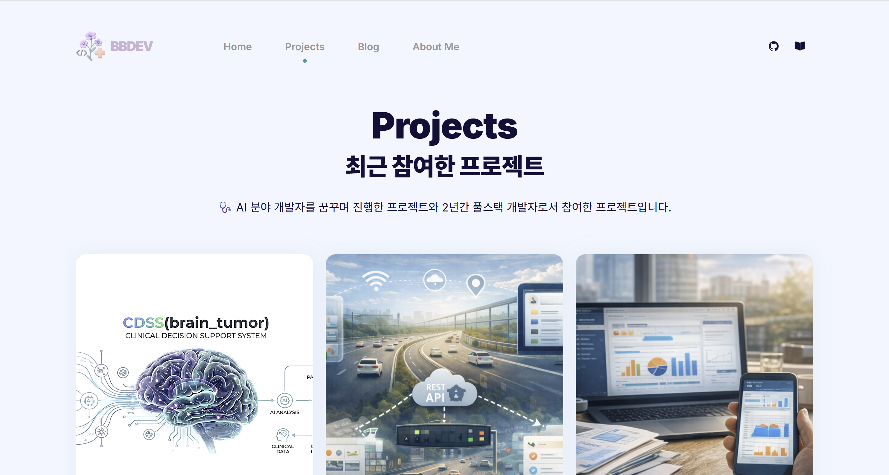

# 노현정 | Backend Developer

Java · Spring Backend Developer | Full-Stack Engineer  
2 years of experience building web services  

[🔗 Portfolio](https://smilebbdev.github.io/)  

## About

2년간 실제 서비스 개발 경험을 보유한 풀스택 개발자입니다.

- Java · Spring 기반 백엔드 개발
- REST API 설계 및 데이터 처리
- React 기반 프론트엔드 개발 경험
- Docker 기반 서비스 운영 및 배포 경험

서비스 구조를 이해하고 문제를 분석하고 개선하는 개발을 지향합니다.

---

## Tech Stack

**Backend**
- Java
- Spring Boot
- JPA / MyBatis
- REST API

**Frontend**
- React
- JavaScript
- HTML / CSS

**Database**
- PostgreSQL
- MySQL

**Mobile**
- Flutter

**DevOps**
- Docker
- Git / GitHub

---

## Projects

### MRI 기반 뇌종양 예측 시스템
바이오메디컬 AI 교육 과정에서 진행한 프로젝트  
MRI 영상과 유전체 데이터를 활용한 멀티모달 AI 기반 CDSS

👨‍💻 Role: Full-Stack Developer

**Backend**
- JWT 기반 인증 및 RBAC 권한 관리 구현
- 사용자 및 권한 관리 API 개발

**Frontend**
- 관리자 사용자 관리 UI 개발
- API 연동 및 상태 관리 구현

**Architecture**
- 시스템 구조 설계

### Web Service Development
실제 서비스 환경에서 웹 기능 개발 및 유지보수 수행

주요 작업
- REST API 설계 및 기능 개발
- 데이터 처리 및 비즈니스 로직 구현
- 기존 서비스 유지보수 및 기능 개선
- 서비스 운영 및 배포 경험
- 장애 및 이슈 대응

---

## Portfolio

🌐 https://smilebbdev.github.io/